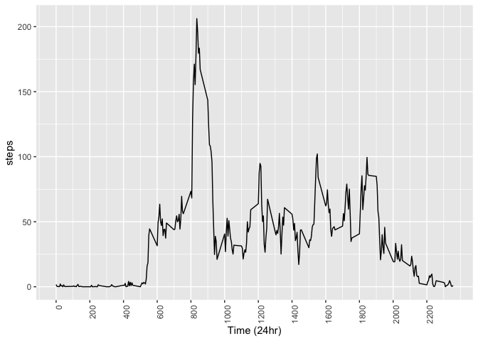
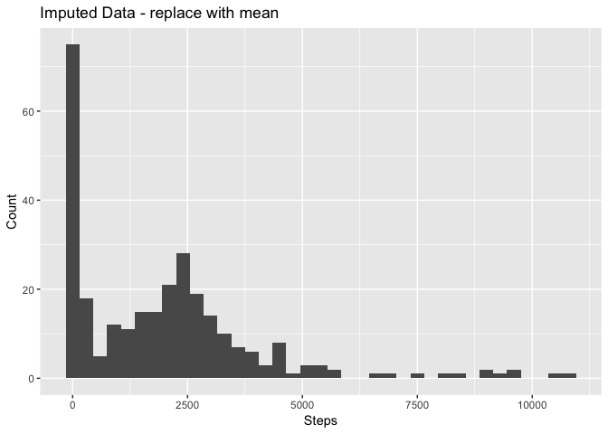
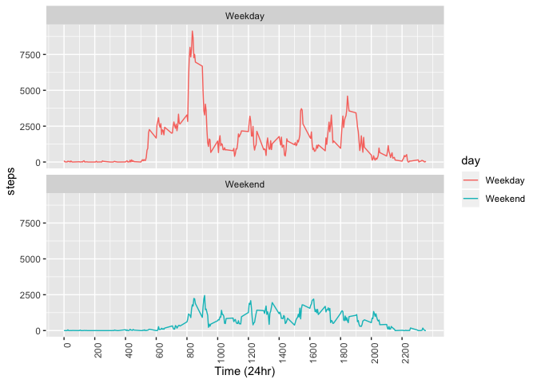

## Loading and preprocessing the data


```r
# download straight from the source
file <- file.path("activity.zip")
if (!file.exists(file)){
  url <- "https://d396qusza40orc.cloudfront.net/repdata%2Fdata%2Factivity.zip"
  download.file(url, file, method = "curl")
}

# unzip file into data folder
if (file.exists(file)){
  unzip(file, exdir='./data')
}

# prep data, need date column
data_na <- read.csv(file.path("./data","activity.csv"))
data <- na.omit(data_na)
data$date <- as.Date(data$date)
```


## What is mean total number of steps taken per day?

```r
steps_per_day <- aggregate(steps ~ date, data, sum)
ggplot(steps_per_day, aes(x=steps)) + geom_histogram(position = "identity", binwidth = 300) +
  scale_x_continuous(breaks = round(seq(0, 22000, by = 2500),1)) +
  ggtitle("Steps per day") + 
  labs(x = "Steps per day", y = "Count")
```

<!-- -->

```r
mean_steps <- ceiling(mean(steps_per_day$steps))
median_steps <- median(steps_per_day$steps)
```
The mean steps per day is 10767.

The median steps per day is 10765.


## What is the average daily activity pattern?

```r
# Merge with your date
data$time <- as.POSIXct(paste(data$date, " ", sprintf("%04s", data$interval)), format = "%Y-%m-%d %H%M")
data$num_interval <- as.numeric(data$interval)

# aggreate the intervals of the day by function
mean_step_by_int <- aggregate(steps ~ num_interval, data, mean)
median_step_by_int <- aggregate(steps ~ num_interval, data, median)

# interval of max number of steps
max_mean_int <- mean_step_by_int[max(mean_step_by_int$steps),]$num_interval

ggplot(mean_step_by_int, aes(x = num_interval, y = steps)) + geom_line() +
  scale_x_continuous(breaks = round(seq(0, 2355, by = 200),1)) + 
  theme(axis.text.x = element_text(angle = 90, hjust = 1)) + 
  xlab(label = "Time (24hr)")
```

<!-- -->

On average, 1705 was the interval of time (24hr) with the most steps to occur during the day.


## Imputing missing values


```r
# impute NAs in by replacing with the mean of the interval of all the days
for (i in 1:nrow(data_impute)){
  data_impute[i,"steps"] <- ifelse(is.na(data_impute[i,"steps"]), 
    mean_step_by_int$steps[mean_step_by_int$interval==data_impute$interval[i]],data_impute[i,"steps"])
}

# agg data to plot
data_impute_agg <- aggregate(steps ~ interval, data_impute, sum)
ggplot(data_impute_agg, aes(x=steps)) + geom_histogram(position = "identity", binwidth = 300) +
  scale_x_continuous(breaks = round(seq(0, 22000, by = 2500),1)) +
  ggtitle("Imputed Data - replace with mean") + 
  labs(x = "Steps", y = "Count")
```

<!-- -->


The data was imputed by replacing the 2304 NAs from the original dataset with the mean steps taken from the same time interval from the rest of the data.

The mean steps with <b>imputed data</b> per day is 1982 compared to the mean of data removing NA values, 10767, thats a difference of 8785 steps.

The median steps  with <b>imputed data</b> per day is 1808 compared to the mean of data removing NA values, 10765, thats a difference of 8957 steps.


## Are there differences in activity patterns between weekdays and weekends?

```r
# create new column with weekdays
data$weekdays <- weekdays(data$date)

# create new column day that sets type of day
data <- mutate(data, day = ifelse(weekdays %in% c("Saturday", "Sunday"), "Weekend", "Weekday"))

# agg data to plot
days_agg <- aggregate(steps ~ day+num_interval, data, sum)
ggplot(days_agg, aes(x = num_interval, y = steps, color = day)) + geom_line() +
  facet_wrap(~day, nrow=2) +
  scale_x_continuous(breaks = round(seq(0, 2355, by = 200),1)) + 
  theme(axis.text.x = element_text(angle = 90, hjust = 1)) + 
  xlab(label = "Time (24hr)")
```

<!-- -->
