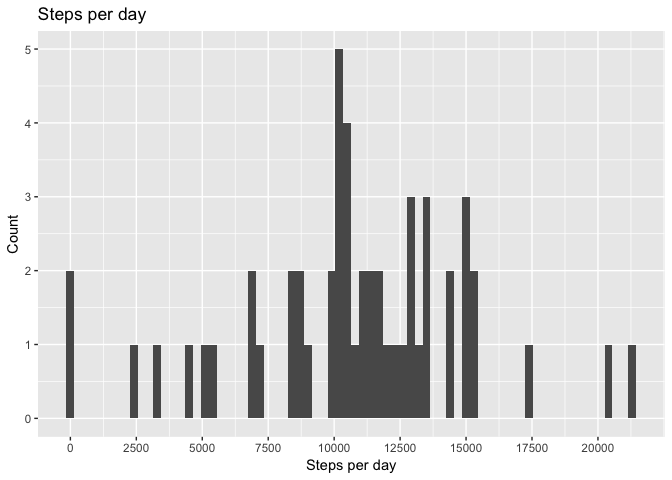

## Loading and preprocessing the data

```r
library(ggplot2)
file <- file.path("activity.zip")

if (!file.exists(file)){
  url <- "https://d396qusza40orc.cloudfront.net/repdata%2Fdata%2Factivity.zip"
  download.file(url, file, method = "curl")
}

# unzip file into data folder
if (file.exists(file)){
  unzip(file, exdir='./data')
}

data_na <- read.csv(file.path("./data","activity.csv"))
data <- na.omit(data_na)
data$date <- as.Date(data$date)
```


## What is mean total number of steps taken per day?

```r
steps_per_day <- aggregate(steps ~ date, data, sum)
ggplot(steps_per_day, aes(x=steps)) + geom_histogram(position = "identity", binwidth = 300) +
  scale_x_continuous(breaks = round(seq(0, 22000, by = 2500),1)) +
  ggtitle("Steps per day") + 
  labs(x = "Steps per day", y = "Count")
```

<!-- -->

```r
mean_steps <- mean(steps_per_day$steps)
median_steps <- median(steps_per_day$steps)
```
The mean steps per day is 1.0766189\times 10^{4}.
The median steps per day is 10765.

## What is the average daily activity pattern?

```r
# convert interval to time
data$interval <- sprintf("%04s", data$interval)

# Merge with your date
data$time <- as.POSIXct(paste(data$date, " ", data$interval), format = "%Y-%m-%d %H%M")

# aggreate the intervals of the day by function
mean_step_by_int <- aggregate(steps ~ interval, data, mean)
mean_step_by_int$num_interval <- as.numeric(mean_step_by_int$interval)
median_step_by_int <- aggregate(steps ~ interval, data, mean)

ggplot(mean_step_by_int, aes(x = num_interval, y = steps)) + geom_line() +
  scale_x_continuous(breaks = round(seq(0, 2355, by = 200),1)) + 
  theme(axis.text.x = element_text(angle = 90, hjust = 1)) + 
  xlab(label = "Time (24hr)")
```

<!-- -->

```r
max_mean_int <- mean_step_by_int[max(mean_step_by_int$steps),]$interval
```


## Imputing missing values


## Are there differences in activity patterns between weekdays and weekends?
